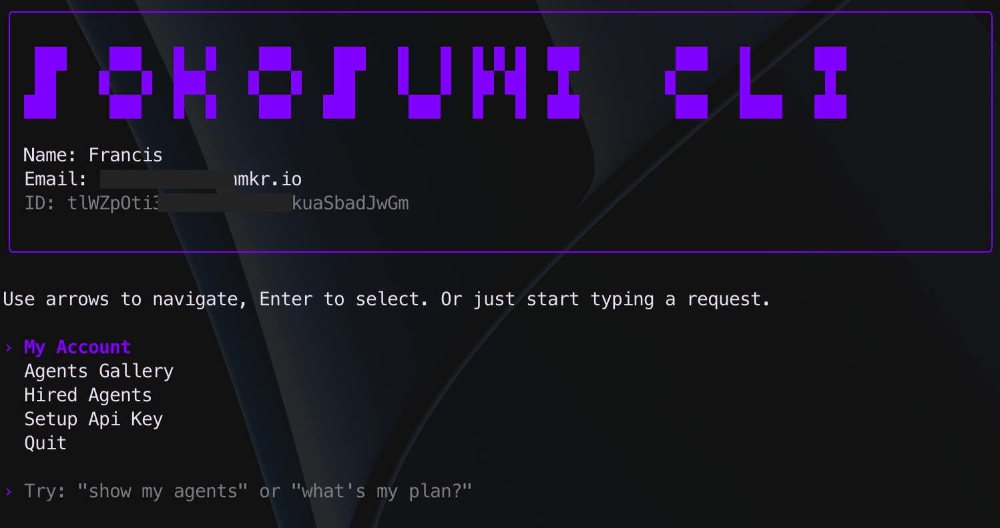

# Sokosumi CLI

A modern command-line interface for managing AI agents, coworkers, and automation workflows on the Sokosumi marketplace.

Browse available agents, hire multi-agent orchestrators, create complex tasks, and monitor your running jobs - all through an intuitive terminal interface with natural language commands.



## ✨ Features

### Core Features
- 🤖 **Agent Gallery** - Browse and hire specialized AI agents
- 👥 **Coworkers** - Multi-agent orchestrators for complex workflows
- 📋 **Task Management** - Create and track multi-step automation tasks
- 💼 **Job Monitoring** - View job status, events, files, and links
- 🔐 **Secure Authentication** - Token-based auth with API key fallback
- 🎨 **Beautiful UI** - Terminal interface with pixel art logo and smooth navigation
- 💬 **Natural Language** - Type requests like "show my agents" and press Enter

### New in v0.2.0
- ✅ **Coworker Support** - Hire orchestrators that coordinate multiple agents
- ✅ **Task System** - Create tasks and add jobs to them dynamically
- ✅ **Enhanced Jobs** - View events, download files, and access output links
- ✅ **Category Filtering** - Browse agents by category
- ✅ **Token Authentication** - Secure token storage in `~/.sokosumi/`
- ✅ **Backward Compatible** - Existing API keys continue to work

## 📋 Requirements

- Node.js >= 18
- pnpm (version pinned via Corepack; see `packageManager` in `package.json`)

The project declares `packageManager: pnpm@10.33.0`.

## 🚀 Installation

### Local Development
```bash
# From project root
corepack enable  # optional; respects package.json packageManager field
pnpm install
pnpm start
```

### npm Distribution
```bash
npm install -g sokosumi-cli
# or
npx sokosumi-cli
```

The package already exposes the `sokosumi` binary. Once published to npm, other users and agent runtimes can install it globally or run it on demand with `npx`.

### Agent Skill

This repo now includes a reusable agent skill at `skills/sokosumi/SKILL.md`.

It captures the live CLI workflow for:
- authentication and API key setup
- agent hiring and coworker task creation
- job and task result review

If you change navigation, auth copy, or storage behavior, update the skill in the same PR so other agents stay aligned.

### Optional Environment Setup
```bash
cp .env.example .env
```

If you skip `.env`, the CLI will still work. It defaults to the production API and stores interactive auth locally under `~/.sokosumi/`.

### Authentication Options

You can authenticate in either of these ways:

```bash
# Optional API override
# Leave this unset for normal CLI usage.
# The CLI prefers production first and falls back to preprod when a user pastes an API key.
# SOKOSUMI_API_URL=https://api.sokosumi.com

# Optional browser auth overrides
# SOKOSUMI_WEB_URL=https://app.sokosumi.com
# SOKOSUMI_AUTH_URL=https://app.sokosumi.com/api/auth

# Option 1: API key (optional if you use interactive setup)
# SOKOSUMI_API_KEY=<your-sokosumi-api-key>

# Option 2: Auth token (managed automatically after login)
# SOKOSUMI_AUTH_TOKEN=your-auth-token-here

# Optional: Anthropic API Key for AI features
ANTHROPIC_API_KEY=<your-anthropic-api-key>
```

On first run, the CLI now offers:
- `Email me a sign-in link`: sends a browser sign-in email and lands you on Sokosumi Connections so you can create an API key.
- `Paste an API key`: verifies the key immediately before saving it.

When a user pastes an API key, the CLI tries `production` first and then `preprod`, stores the matching API URL automatically, and switches the browser/auth URLs to match. The production browser target is `app.sokosumi.com`, not the marketing site root. Users do not need to pick the environment manually.

Saved interactive configuration lives in:
- `~/.sokosumi/config.json` for API key and CLI config
- `~/.sokosumi/credentials.json` for auth tokens

## 🎮 Usage

### Main Menu

When you start the CLI, you'll see the main menu with the following options:

```
┌─────────────────────────────────────┐
│  SOKOSUMI CLI                       │
├─────────────────────────────────────┤
│  Name: Your Name                    │
│  Email: you@example.com             │
├─────────────────────────────────────┤
│  > My Account                       │
│    Agents Gallery                   │
│    Coworkers (Multi-Agent)          │
│    My Tasks                         │
│    My Jobs                          │
│    Authentication                   │
│    Quit                             │
└─────────────────────────────────────┘
```

### Navigation

- **Arrow Keys (↑/↓)**: Navigate menu items
- **Enter**: Select an item
- **Esc**: Go back to previous screen
- **Type**: Enter natural language commands

### Feature Overview

#### 1. My Account
View your user profile information:
- Name
- Email
- Account ID

#### 2. Agents Gallery
Browse and hire specialized AI agents:
- View all available agents with pricing
- See agent descriptions and tags
- View agent details
- Hire agents for specific tasks
- Check input schema requirements

#### 3. Coworkers (Multi-Agent) 🆕
Hire orchestrators that coordinate multiple agents:
- Browse available coworkers
- View capabilities and estimated duration
- See pricing for orchestration services
- Create tasks with coworkers

#### 4. My Tasks 🆕
Manage your automation tasks:
- View all your tasks
- See task status (pending, running, completed, failed)
- Track job count per task
- Refresh task list

#### 5. My Jobs
View and manage your active agent jobs:
- List all hired agents
- Check job status
- View job outputs

### Natural Language Commands

You can also type commands directly from the main menu:

```
> show my agents
> what's my plan?
> list coworkers
> create a task
```

The CLI will interpret your request and navigate to the appropriate screen.

## 🔧 Advanced Features

### Token Authentication

The CLI supports secure token authentication stored in `~/.sokosumi/credentials.json`:

```json
{
  "authToken": "tok_abc123...",
  "refreshToken": "ref_xyz789...",
  "expiresAt": "2026-12-31T23:59:59Z",
  "userId": "user_123",
  "email": "you@example.com"
}
```

Tokens are stored with `0o700` permissions for security and include automatic expiry checking with a 5-minute buffer.

### API Key Storage

Interactive API key setup stores the key in `~/.sokosumi/config.json` so the CLI works cleanly when installed via npm and run from any directory.

### API Integration

All features are powered by the Sokosumi API. The CLI automatically handles:
- Authentication (Bearer tokens or API keys)
- Error handling with user-friendly messages
- Loading states and progress indicators
- Retry logic for network failures

## 📚 API Endpoints

### Agents
- `GET /api/v1/agents` - List all agents
- `GET /api/v1/agents/:id` - Get agent details
- `GET /api/v1/agents/:id/input-schema` - Get input requirements
- `POST /api/v1/agents/:id/jobs` - Hire an agent

### Coworkers 🆕
- `GET /coworkers` - List all coworkers
- `GET /coworkers/:id` - Get coworker details

### Tasks 🆕
- `POST /tasks` - Create a new task
- `GET /tasks` - List your tasks
- `GET /tasks/:id` - Get task details
- `POST /tasks/:id/jobs` - Add a job to a task

### Jobs 🆕 Enhanced
- `GET /jobs/:id` - Get job status
- `GET /jobs/:id/events` - Get job event log
- `GET /jobs/:id/files` - Get job file outputs
- `GET /jobs/:id/links` - Get job link outputs
- `GET /jobs/:id/input-request` - Check for input requests
- `POST /jobs/:id/inputs` - Provide additional input

### Categories 🆕
- `GET /categories` - List all categories
- `GET /categories/:id` - Get category details

### User
- `GET /api/v1/users/me` - Get current user info

## 🎨 Keyboard Shortcuts

| Key | Action |
|-----|--------|
| `↑` / `↓` | Navigate menu items |
| `Enter` | Select / Submit |
| `Esc` | Go back |
| Type text | Natural language command |

## 📦 Scripts

| Command | Description |
|---------|-------------|
| `pnpm start` | Run the CLI |
| `pnpm run smoke:imports` | Import-check core views and auth flows |

## 🏗️ Architecture

The CLI is built with a modular architecture:

```
src/
├── auth/              # Authentication system
│   ├── auth-manager.mjs    # Token lifecycle management
│   └── token-store.mjs     # Secure token storage
├── api/               # API layer
│   ├── http-client.mjs     # HTTP client with auth
│   ├── models/             # Data models
│   └── services/           # API services
├── components/        # Reusable UI components
├── views/             # Screen components
├── utils/             # Helper utilities
└── app.mjs            # Main application

```

### Key Patterns

- **Models**: Classes with `static from()` factory methods
- **Services**: Async functions that return `{response, data}`
- **Views**: React components using Ink for terminal UI
- **Auth**: Singleton pattern for token management

## 🔐 Security

- Tokens stored in `~/.sokosumi/` with `0o700` permissions
- Automatic token expiry checking
- Secure credential management
- No hardcoded secrets

## 🐛 Troubleshooting

### CLI won't start

```bash
# Reinstall dependencies
rm -rf node_modules pnpm-lock.yaml
pnpm install

# Check Node version
node --version  # Should be >= 18
```

### Authentication errors

```bash
# Start the interactive auth flow
pnpm start
# Select "Authentication" from the menu

# Inspect local CLI config
cat ~/.sokosumi/config.json
```

### Token issues

```bash
# Clear stored tokens
rm -rf ~/.sokosumi/

# Restart CLI
pnpm start
```

## 🗺️ Roadmap

### Phase 3: Enhanced Features (In Progress)
- [ ] Job details view UI
- [ ] Job events viewer UI
- [ ] Job outputs display UI
- [ ] Task creation flow
- [ ] Task details view

### Phase 4: Plugin Architecture (Planned)
- [ ] SDK for integrations
- [ ] CLI flags (`--json`, `--auth-token`)
- [ ] Non-interactive mode
- [ ] Example plugins
- [ ] Integration documentation

### Phase 5: Polish & Documentation (Planned)
- [ ] Comprehensive testing
- [ ] Performance optimization
- [ ] Cross-platform testing
- [ ] Migration guide
- [ ] npm publish

## 📖 Documentation

- [IMPLEMENTATION_PLAN.md](./IMPLEMENTATION_PLAN.md) - Detailed architecture plan
- [STATUS.md](./STATUS.md) - Current implementation status
- [AGENTS.md](./AGENTS.md) - Guidelines for AI agents working on this project
- [IMPLEMENTATION_SUMMARY.md](./IMPLEMENTATION_SUMMARY.md) - Session summaries
- [CHANGELOG.md](./CHANGELOG.md) - Version history

## 🤝 Contributing

This project follows established patterns and conventions documented in [AGENTS.md](./AGENTS.md).

### Development Guidelines

1. Follow existing code patterns
2. Update STATUS.md when completing tasks
3. Write clear commit messages
4. Test thoroughly before submitting
5. No git operations without explicit approval

## 📄 License

MIT

## 🔗 Links

- [Sokosumi Marketplace](https://app.sokosumi.com)
- [Documentation](https://docs.sokosumi.com)
- [API Reference](https://api.sokosumi.com/docs)

## 🙏 Acknowledgments

Built with:
- [Ink](https://github.com/vadimdemedes/ink) - React for CLIs
- [Chalk](https://github.com/chalk/chalk) - Terminal colors
- [dotenv](https://github.com/motdotla/dotenv) - Environment variables

---

**Current Version**: 0.2.0
**Last Updated**: 2026-03-24
**Status**: 45% Complete (Phase 2 finished, Phase 3 in progress)
